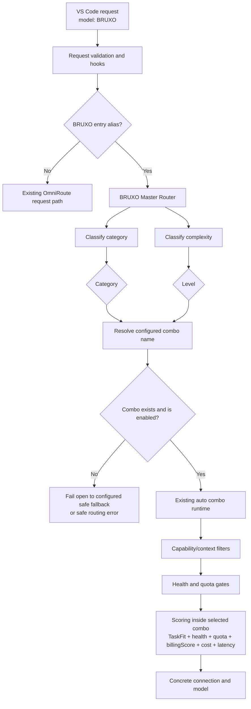

# BRUXO Master Router

## 1. Summary

Create an internal master-routing layer for the single client-facing model `BRUXO`.

The VS Code client continues to send only `model: "BRUXO"`. It does **not** send
the work category (`coder`, `agentic`, `analyser`, `vision`) or an execution level
(`mid`, `high`, `xhigh`, `max`). The OmniRoute server derives both from the request
and resolves one persisted specialized combo before normal combo dispatch.

```text
VS Code
  model: BRUXO
       ↓
BRUXO Master Router
  category + difficulty level
       ↓
Direct specialized combo, for example: agentic-xhigh
       ↓
Existing auto-combo candidate filtering, health/quota gates, scoring and fallback
       ↓
Provider connection + concrete model
```

This feature adds a dispatch layer. It does not replace the existing combo engine,
provider health handling, quota handling, capability filters, or connection-level
billing scoring.

## 2. Problem

The existing request path can apply task-aware overrides through
`open-sse/services/taskAwareRouter.ts::applyTaskAwareRouting`. Its persisted mapping
currently routes coarse task types such as `coding` and `analysis` to generic
`auto/*` intents. It does not resolve a single entry model to a business-specific
matrix such as:

```text
coder-mid       coder-high       coder-xhigh
agentic-mid     agentic-high     agentic-xhigh
analyser-mid    analyser-high    analyser-xhigh
```

The currently selected VS Code agent (`Ask`, `Plan`, `Agent`, or a custom agent such
as Multi-task or Sub-agent) is not assumed to be a reliable field in the upstream
OpenAI-compatible request. Its selected name must not be required for routing.

The client must remain simple: it selects `BRUXO`, while OmniRoute makes the routing
decision using observable request signals.

## 3. Goals

1. Accept `BRUXO` as the only required client-facing model identifier.
2. Classify a request into `coder`, `agentic`, `analyser`, or `vision`.
3. Classify intrinsic request difficulty into `mid`, `high`, `xhigh`, or `max`.
4. Resolve the resulting category/level pair to a persisted combo by name.
5. Reuse the existing `auto` combo runtime for all provider/model selection.
6. Keep difficulty structural: a request selected as `agentic-xhigh` must not be
   downgraded to an `agentic-mid` target merely because it is cheaper.
7. Inside the selected combo, prefer healthy, quota-available, economically
   appropriate connections using the existing scoring system, including connection
   `billing_mode` / `billingScore` where deployed.
8. Preserve existing behavior for every model other than configured BRUXO entry
   aliases.
9. Require no VS Code extension or agent-definition protocol changes.

## 4. Non-goals

- Infer the visible VS Code agent name as authoritative routing metadata.
- Send the request to a classifier provider or consume provider quota merely to
  select a combo.
- Replace `handleComboChat`, `resolveAutoStrategyOrder`, connection cooldown,
  circuit breaker, quota cutoff, tool compatibility, context-window filtering, or
  existing fallback behavior.
- Make `FREE` win over a category/level constraint.
- Create or enable a combo for a provider that is currently unavailable.
- Implement a dashboard editor in this feature. The Routing Policy Studio remains
  a separate feature described in `docs/routing/OBRUXO_ROUTING_POLICY_STUDIO_SPEC.md`.

## 5. Existing Building Blocks

| Capability                                   | Existing implementation                                                      | Use in this feature                                                                               |
| -------------------------------------------- | ---------------------------------------------------------------------------- | ------------------------------------------------------------------------------------------------- |
| Request interception before combo resolution | `src/sse/handlers/chat.ts`                                                   | Insert BRUXO route resolution after hooks and before normal combo dispatch.                       |
| Task category detection                      | `open-sse/services/taskAwareRouter.ts::detectTaskType`                       | Reuse image, coding and analysis detection.                                                       |
| Prompt-intent classification                 | `open-sse/services/intentClassifier.ts::classifyWithConfig`                  | Supplement category detection for coding/reasoning signals.                                       |
| Complexity classification                    | `open-sse/services/autoCombo/complexityRouter.ts::classifyRequestComplexity` | Reuse `trivial`, `simple`, `moderate`, `complex`, `expert` signals.                               |
| Tool detection / filtering                   | `open-sse/services/combo/resolveAutoStrategy.ts`                             | Use tools as an agentic signal and preserve existing capability filtering after combo resolution. |
| Persisted combo lookup                       | `src/lib/localDb.ts::getComboByName`                                         | Validate resolved combo existence before override.                                                |
| Combo execution                              | `open-sse/services/combo.ts::handleComboChat`                                | Execute the selected specialized combo unchanged.                                                 |
| Auto candidate scoring                       | `open-sse/services/autoCombo/scoring.ts`                                     | Score only candidates within the selected combo.                                                  |
| Connection billing class                     | `provider_connections.billing_mode`                                          | Prefer `FREE > PLAN > METERED` only among valid candidates in the resolved combo.                 |

## 6. Target Architecture

### 6.1 Client contract

Every supported VS Code agent keeps the same model identifier:

```json
{
  "model": "BRUXO",
  "messages": ["..."],
  "tools": []
}
```

The surrounding VS Code agent changes the nature of the request, not the routing
model ID:

| VS Code agent style | Observable server signals                                            | Expected tendency                                                                                |
| ------------------- | -------------------------------------------------------------------- | ------------------------------------------------------------------------------------------------ |
| Ask                 | Question, limited context, no tools                                  | `analyser-mid` or `coder-mid`, depending on content.                                             |
| Plan                | Analysis, comparison, architecture, planning language, broad context | `analyser-high` or `analyser-xhigh`.                                                             |
| Agent               | Tools, file-editing requests, commands, implementation tasks         | Tools are a capability requirement; the semantic route can be `coder`, `analyser` or `reviewer`. |
| Multi-task          | Multiple deliverables, broad context, several files/tools            | `agentic` with the configured `multiTask` floor.                                                 |
| Sub-agent           | Delegated task, unless explicit coding/review intent wins            | `agentic` at the calculated level.                                                               |

### 6.2 Routing pipeline



### 6.3 Required routing invariant

The master router selects the **required capability band** before economic scoring.

```text
BRUXO request with genuine delegation
→ category = agentic
→ level = xhigh
→ combo = agentic-xhigh
→ only targets registered in agentic-xhigh are eligible
→ scoring chooses the best healthy target in that combo
```

`billingScore` is therefore not a cross-level selector. It must not route an
`agentic-xhigh` task to a free target from `agentic-mid`. It is an operational and
economic preference among the targets deliberately admitted to `agentic-xhigh`.

## 7. Route Classification

### 7.1 Category selection

The router must derive a single category using request signals in this priority order:

| Priority | Signal                                                                              | Category                                    |
| -------- | ----------------------------------------------------------------------------------- | ------------------------------------------- |
| 1        | Image content (`image_url` / image parts)                                           | `vision`                                    |
| 2        | Explicit `subagent`/`multi-task` delegation                                         | `agentic`                                   |
| 3        | Coding patterns, source code, implementation/debug/refactor/test requests           | `coder`                                     |
| 4        | Analysis, investigation, comparison, architecture, planning or explanation requests | `analyser`                                  |
| 5        | No strong signal                                                                    | Configurable fallback, initially `analyser` |

`tools` is recorded as `none`, `available` or `required` and acts as a
capability constraint inside the selected semantic combo. It does not replace
the category and does not impose a global `HIGH` floor.

The router must use existing `detectTaskType` and intent/complexity helpers where
possible. New logic should be a small pure adapter, not a second independent
keyword engine.

### 7.2 Level selection

Base mapping from `classifyRequestComplexity`:

| Existing complexity | BRUXO level |
| ------------------- | ----------- |
| `trivial`, `simple` | `mid`       |
| `moderate`          | `high`      |
| `complex`           | `xhigh`     |
| `expert`            | `max`       |

The router then applies only upward floors:

| Condition                                                                   | Minimum level                                                |
| --------------------------------------------------------------------------- | ------------------------------------------------------------ |
| `subagent`/`multi-task` delegation                                          | Configured `multiTask` floor                                 |
| Tool/function schema                                                        | No automatic level promotion; it is a capability requirement |
| Security-critical, irreversible migration, or explicit critical-risk signal | `xhigh`; configurable escalation to `max`                    |
| Estimated context exceeds a configured threshold                            | `xhigh`                                                      |

No rule may lower the base complexity-derived level.

### 7.3 Missing-combo fallback

The initial approved matrix contains `mid`, `high`, and `xhigh`. If `max` is
classified before `*-max` combos are registered, the configured default must be:

```text
max → xhigh
```

This fallback must be explicit in logs and route-preview metadata. It must not
silently select a lower level.

## 8. Configuration Contract

Persist a `bruxoRouting` object in existing settings storage. The initial settings
shape should be validated server-side and read atomically on each route decision:

```ts
type BruxoCategory = "coder" | "agentic" | "analyser" | "vision";
type BruxoLevel = "mid" | "high" | "xhigh" | "max";

type BruxoRoutingConfig = {
  enabled: boolean;
  entryModels: string[];
  fallbackCategory: BruxoCategory;
  maxFallbackLevel: "xhigh" | "max";
  routes: Partial<Record<BruxoCategory, Partial<Record<BruxoLevel, string>>>>;
  levelFloors: {
    multiTask: BruxoLevel;
    criticalRisk: BruxoLevel;
    largeContext: BruxoLevel;
  };
};
```

Initial route map:

```json
{
  "enabled": true,
  "entryModels": ["BRUXO", "obruxo"],
  "fallbackCategory": "analyser",
  "maxFallbackLevel": "xhigh",
  "routes": {
    "coder": {
      "mid": "coder-mid",
      "high": "coder-high",
      "xhigh": "coder-xhigh"
    },
    "agentic": {
      "mid": "agentic-mid",
      "high": "agentic-high",
      "xhigh": "agentic-xhigh"
    },
    "analyser": {
      "mid": "analyser-mid",
      "high": "analyser-high",
      "xhigh": "analyser-xhigh"
    }
  },
  "levelFloors": {
    "multiTask": "xhigh",
    "criticalRisk": "xhigh",
    "largeContext": "xhigh"
  }
}
```

`vision` remains absent until its specialized combos and validated providers are
registered. A vision request must fail over to the configured safe behavior rather
than being sent to a text-only combo.

## 9. Specialized Combo Requirements

### 9.1 Initial enabled providers

Initial specialized combos must use only providers that the operator has validated
as primary routing candidates:

| Provider family    | Connection billing classification | Availability policy                                                                                                      |
| ------------------ | --------------------------------- | ------------------------------------------------------------------------------------------------------------------------ |
| DeepSeek V4 Flash  | `FREE`                            | Existing no-cost route; admit only where validated for the level/task.                                                   |
| Gemini Pro / Flash | `PLAN`                            | Admit based on capability and current connection health.                                                                 |
| Claude Max         | `PLAN`                            | Do not admit while its connection is unavailable; it may be re-enabled after health recovery.                            |
| Codex Pro          | `PLAN`                            | Prefer Raphael and Pedro accounts before aidevonetech through existing connection priority and quota/health eligibility. |
| Kimi Code Allegro  | `PLAN`                            | Admit for validated coding/analysis roles.                                                                               |

Metered OpenAI-compatible connections are not primary candidates in the initial
matrix. They remain available only where explicitly added as a deliberate fallback
in a specialized combo.

### 9.2 Combo content

Each specialized combo remains a persisted `strategy: "auto"` combo with concrete
model targets. It must not use an unverified provider merely because that provider
has a favorable public price.

The approved initial model matrix is maintained in the corresponding combo records;
the master router resolves only combo names and does not hard-code provider/model
identifiers.

## 10. Scoring Policy Inside a Specialized Combo

After category and level are selected, existing auto-combo behavior remains in
control.

Recommended factor ordering for BRUXO specialized combos:

```text
Mandatory eligibility: tools, vision, context window, active connection
    ↓
Difficulty band: enforced by selected combo
    ↓
TaskFit / capability suitability
    ↓
Health and quota availability
    ↓
billingScore (FREE > PLAN > METERED)
    ↓
Catalog cost and latency
```

`billingScore` uses the connection's `billing_mode` and must remain separate from
catalog `costInv`:

| billing_mode | Economic meaning                                       |
| ------------ | ------------------------------------------------------ |
| `FREE`       | No marginal charge and no paid-plan quota consumption. |
| `PLAN`       | Included in a subscription; plan quota still matters.  |
| `METERED`    | Variable per-request cost.                             |
| `NULL`       | Legacy-neutral behavior until explicitly classified.   |

A recommended initial weight profile is intentionally quality/difficulty dominant,
for example `taskFit` greater than `quota` and `billingScore`. Exact normalized
weights belong to each persisted specialized combo and must be tested with route
previews before activation.

## 11. Implementation Plan

### 11.1 New pure service

Create a small service, for example:

```text
open-sse/services/bruxoMasterRouter.ts
```

Public responsibilities:

```ts
resolveBruxoRoute({ model, body, settings }): {
  matched: boolean;
  category?: BruxoCategory;
  level?: BruxoLevel;
  resolvedCombo?: string;
  reason?: string;
  fallbackApplied?: boolean;
}
```

Requirements:

- no provider calls;
- no database writes;
- deterministic for a given request/settings input;
- bounded prompt inspection only through existing classifiers;
- fail closed for an invalid configured target only when no configured safe fallback
  exists; otherwise use the explicit fallback and log the reason.

### 11.2 Request-path integration

Integrate in `src/sse/handlers/chat.ts` after hooks have finalized `body` and
`modelStr`, and before the existing task-aware override and combo/model resolution.

When the incoming model matches `entryModels`:

1. load validated `bruxoRouting` settings;
2. call `resolveBruxoRoute`;
3. set `resolvedModelStr` and `body.model` to the selected persisted combo name;
4. preserve the original requested model for safe observability;
5. allow the normal combo request path to resolve and dispatch that combo.

The existing generic task-aware override must not overwrite a successfully resolved
BRUXO specialized combo. This can be achieved by skipping generic task-aware
replacement after `BRUXO` routing, or by ensuring the BRUXO route runs at the
appropriate precedence and marks the request as already routed.

### 11.3 Settings validation and API

Add a schema for `bruxoRouting` to the existing settings validation/persistence path.
The schema must validate:

- recognized categories and levels;
- non-empty, unique entry aliases;
- valid configured level floors;
- combo-name values as non-empty strings;
- no route loop back to a BRUXO entry model.

A management settings endpoint may expose this object, but implementation must not
require a dashboard UI in the first release.

### 11.4 Route observability

Add safe route-decision metadata to logs and route preview where supported:

```text
requestedModel=BRUXO
category=agentic
complexity=complex
level=xhigh
resolvedCombo=agentic-xhigh
fallbackApplied=false
```

Do not log raw prompt content, secrets, authorization headers, or tool arguments.

## 12. Tests

### 12.1 Unit tests for the pure router

Cover at least:

1. BRUXO alias matching is case-normalized as configured.
2. Non-BRUXO models are unchanged.
3. Image request resolves `vision` when a valid vision route exists.
4. Tools resolve `agentic` and floor to at least `high`.
5. Coding request resolves `coder`.
6. Architecture/planning request resolves `analyser`.
7. `trivial/simple/moderate/complex/expert` map to the correct levels.
8. Floors only elevate levels.
9. `max` falls back to `xhigh` when no max route exists.
10. Missing selected combo returns the explicit safe fallback or a safe error.
11. Route maps cannot route back to `BRUXO`.

### 12.2 Request-path integration tests

Assert that:

- `model: BRUXO` becomes the intended specialized combo before standard combo
  resolution;
- generic task-aware routing does not overwrite the selected specialized combo;
- the final specialized combo still runs normal tool/context/health/quota filters;
- a provider with an open circuit breaker is not selected when a healthy target in
  the same specialized combo exists;
- billing preference never violates a category/level boundary.

### 12.3 Regression tests

- Existing non-BRUXO combo and direct-model requests retain current behavior.
- BRUXO routing disabled preserves current handling of the requested model.
- A malformed `bruxoRouting` settings payload is rejected without changing the
  prior valid persisted configuration.

## 13. Rollout

1. Implement and test the pure router and settings validation.
2. Deploy code without enabling `bruxoRouting`.
3. Register and validate specialized `coder-*`, `agentic-*`, and `analyser-*`
   combos using only approved provider/model targets.
4. Enable routing with `entryModels: ["BRUXO"]` in a controlled environment.
5. Use route preview and safe routing logs to verify category/level decisions.
6. Add aliases such as `obruxo` only after `BRUXO` is validated.
7. Add `vision-*` and `*-max` routes only after their candidate pools are validated.

## 14. Acceptance Criteria

1. A VS Code request containing only `model: "BRUXO"` is sufficient to activate
   the master router.
2. The router selects category and level without requiring the VS Code agent label.
3. The router resolves a registered specialized combo before normal combo dispatch.
4. Difficulty selection occurs before economic scoring.
5. Provider selection inside the specialized combo retains existing health, quota,
   capability, context, billing, fallback, and connection-priority behavior.
6. Requests cannot reach unavailable/unregistered targets through the master route.
7. Non-BRUXO requests remain behavior-compatible.
8. Every BRUXO decision is observable through safe structured metadata.
